# Option Exercise in Backtesting

## Overview

The Nautilus Trader option exercise system provides automatic exercise functionality for options during backtesting. The system correctly handles option expiry based on whether options are in-the-money (ITM) or out-of-the-money (OTM):

- **ITM options**: Automatically exercised (long positions) or assigned (short positions) with appropriate underlying positions created
- **OTM options**: Expire worthless with positions closed at zero value
- **Settlement types**:
  - **Cash-settled options** (index options): Create underlying positions at intrinsic value (payoff)
  - **Physically-settled options** (equity options): Create underlying positions at strike price

The system is implemented as a high-performance Cython module for optimal backtesting performance.

## Key Features

- **Correct Option Exercise Logic**:
  - ITM long options are automatically exercised at expiry
  - ITM short options are automatically assigned at expiry
  - OTM options (both long and short) expire worthless
- **Settlement Type Detection**: Automatically detects cash vs physical settlement based on underlying instrument type
- **Correct Pricing Logic**:
  - Cash-settled options: Create positions at intrinsic value (payoff)
  - Physically-settled options: Create positions at strike price
  - OTM expiry: Positions closed at zero value (worthless)
- **Unrealized PnL Reset**: Option positions closed at average opening price to zero out unrealized PnL
- **Quantity Calculation**: Correct position size based on option multiplier and contracts
- **Threshold Control**: Minimum ITM amount required for exercise
- **High Performance**: Implemented in Cython for optimal backtesting performance
- **Comprehensive Logging**: Detailed exercise event logging

## Architecture

### OptionExerciseModule

The core component is `OptionExerciseModule`, a high-performance Cython implementation that extends `SimulationModule` to integrate with the backtesting engine. The module provides optimal performance through compiled C extensions while maintaining full Python API compatibility.

```python
from nautilus_trader.backtest.option_exercise import OptionExerciseConfig
from nautilus_trader.backtest.option_exercise import OptionExerciseModule

# Create configuration
config = OptionExerciseConfig(
    auto_exercise_enabled=True,
)

# Create module
exercise_module = OptionExerciseModule(config)
```

### Integration with Backtesting Engine

Add the module to your venue configuration:

```python
from nautilus_trader.backtest.engine import BacktestEngine

engine = BacktestEngine(config)

# Add venue with option exercise module
engine.add_venue(
    venue=Venue("NASDAQ"),
    oms_type=OmsType.NETTING,
    account_type=AccountType.MARGIN,
    starting_balances=[Money(100_000, USD)],
    modules=[exercise_module],  # Add the module here
)
```

## System Architecture

The option exercise system uses an efficient timer-based architecture that only processes when needed, providing optimal performance while maintaining full functionality.

### Core Components

1. **OptionExerciseModule**: The main simulation module that handles exercise logic
2. **OptionExerciseConfig**: Configuration class for customizing behavior
3. **Timer Management**: Event-driven processing using position events and expiry timers
4. **Message Bus Integration**: Subscribes to position events for automatic timer setup

### Timer-Based Processing Flow

The system operates using an efficient event-driven approach:

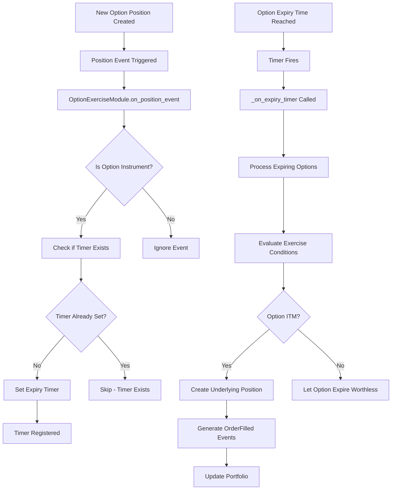

### Performance Benefits

- **✅ Zero Overhead**: No processing when no option positions exist
- **✅ Event-Driven**: Only processes when positions are created/modified
- **✅ Precise Timing**: Timers fire exactly at option expiry timestamps
- **✅ Scalable**: Handles large numbers of option positions efficiently
- **✅ Memory Efficient**: Minimal state tracking with smart caching

## Sequence Diagrams

### Position Event Processing Sequence

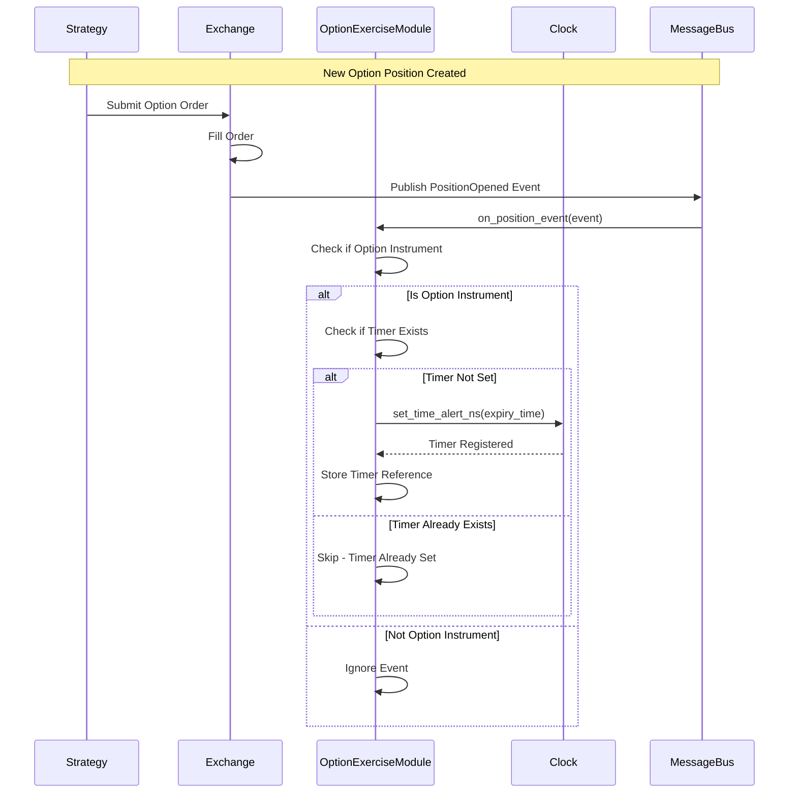

### Option Expiry Processing Sequence

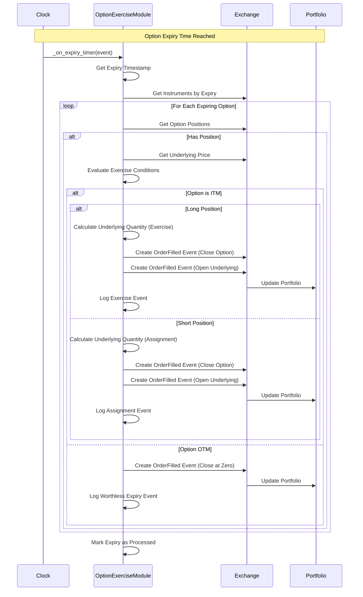

### Complete System Flow

```mermaid
graph LR
    subgraph "Initialization"
        A[Create OptionExerciseModule] --> B[Register with Exchange]
        B --> C[Subscribe to Position Events]
    end

    subgraph "Runtime - Position Events"
        D[Option Position Created] --> E[Position Event Fired]
        E --> F[Timer Set for Expiry]
    end

    subgraph "Runtime - Expiry Processing"
        G[Expiry Time Reached] --> H[Timer Fires]
        H --> I[Process Expiring Options]
        I --> J[Exercise ITM Options]
        J --> K[Create Underlying Positions]
    end

    C --> D
    F --> G
    K --> L[Portfolio Updated]
```

## Configuration Options

### OptionExerciseConfig Parameters

| Parameter | Type | Default | Description |
|-----------|------|---------|-------------|
| `auto_exercise_enabled` | bool | True | Enable/disable automatic exercise |

**Logging**: All option exercise events are logged at debug level. Enable debug logging to see detailed exercise information.

**Notes**:

- Exercise thresholds are automatically determined based on the underlying instrument's tick size
- Settlement type is automatically detected based on underlying instrument type:
  - `IndexInstrument`: Cash-settled (uses intrinsic value for new positions)
  - Other instruments: Physically-settled (uses strike price for new positions)
- Option positions are always closed at their average opening price to ensure unrealized PnL becomes zero

### Example Configurations

**Basic Configuration**:

```python
config = OptionExerciseConfig(
    log_exercises=True,
    detailed_logging=True,
)
```

**Verbose Logging**:

```python
config = OptionExerciseConfig(
    log_exercises=True,
    log_skipped=True,
    detailed_logging=True,
)
```

**Disabled Exercise** (for comparison):

```python
config = OptionExerciseConfig(
    auto_exercise_enabled=False,  # No automatic exercise
)
```

**Minimal Logging**:

```python
config = OptionExerciseConfig(
    log_exercises=False,
    log_skipped=False,
    detailed_logging=False,
)
```

## Exercise Logic

### Exercise Conditions

An option is exercised if ALL conditions are met:

1. **Expiry Time**: Current time >= option expiration time
2. **ITM Status**: Option is in-the-money
3. **Threshold**: Intrinsic value >= underlying instrument's tick size
4. **Market Data**: Underlying price available

**Note**: Index options are always exercisable as they are cash-settled.

### ITM Determination

- **Call Options**: Underlying price > strike price
- **Put Options**: Underlying price < strike price

### Short Option Exercise

Short option positions are automatically exercised when it's profitable to do so:

**Short Exercise Conditions**:

1. **Expiry Time**: Current time >= option expiration time
2. **OTM Status**: Option is out-of-the-money (from long holder's perspective)

**Assignment Logic for Short Positions**:

- **Short Call**: Assigned when underlying price > strike price (call is ITM)
- **Short Put**: Assigned when underlying price < strike price (put is ITM)

When a short position is assigned, the option position is closed and an underlying position is created at the strike price, simulating the assignment process. Assignment happens automatically when ITM conditions are met.

### Position Creation

When exercised, the system creates:

**For Call Options**:

- **Long Call** → **Long Underlying** (quantity = contracts × multiplier)
- **Short Call** → **Short Underlying** (quantity = contracts × multiplier)

**For Put Options**:

- **Long Put** → **Short Underlying** (quantity = contracts × multiplier)
- **Short Put** → **Long Underlying** (quantity = contracts × multiplier)

**Average Price**: Always set to the strike price (exercise price)

## Technical Implementation

### Timer Management Architecture

The system uses a sophisticated timer-based approach for optimal performance:

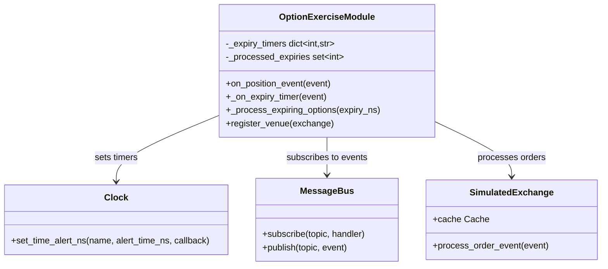

### State Management

The module maintains minimal state for maximum efficiency:

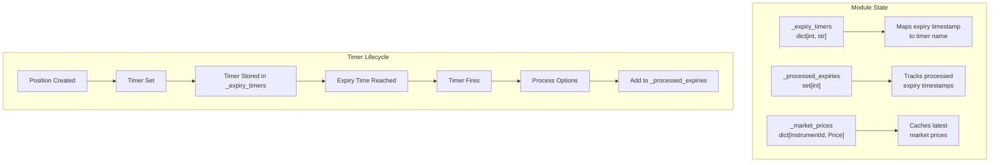

### Event Flow Diagram

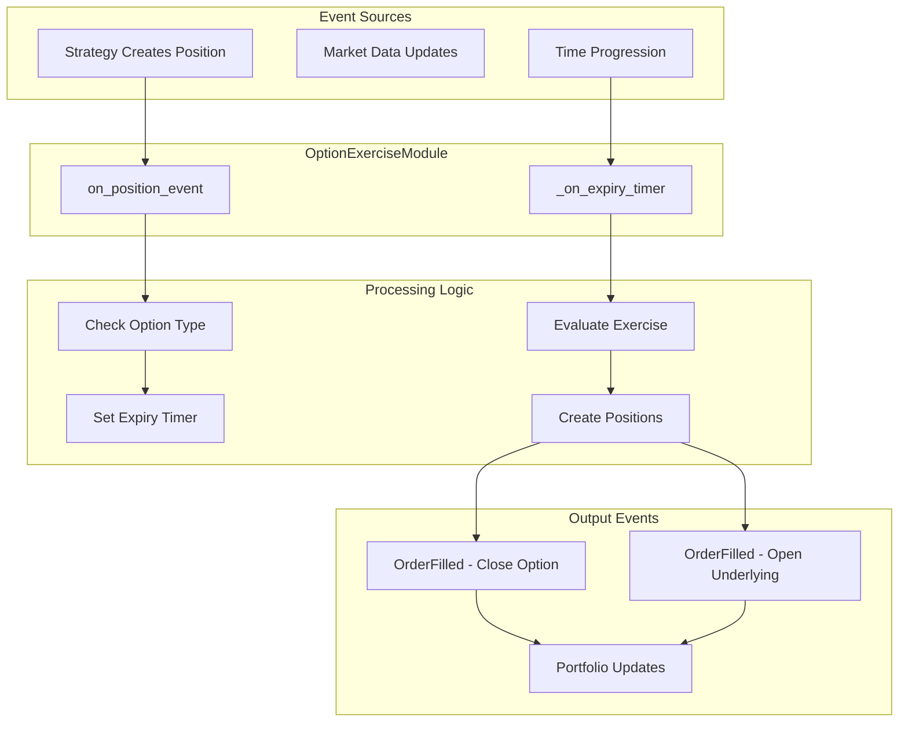

### Performance Characteristics

The timer-based approach provides significant performance benefits:

| Aspect | Time-Based (Old) | Timer-Based (New) |
|--------|------------------|-------------------|
| **Processing Frequency** | Every time advancement | Only on position events + expiry |
| **CPU Usage** | Continuous | Event-driven |
| **Memory Usage** | Tracks all options daily | Minimal timer tracking |
| **Scalability** | O(n) per time step | O(1) per position event |
| **Latency** | Depends on time step | Immediate on events |

### Error Handling and Edge Cases

The system handles various edge cases gracefully:

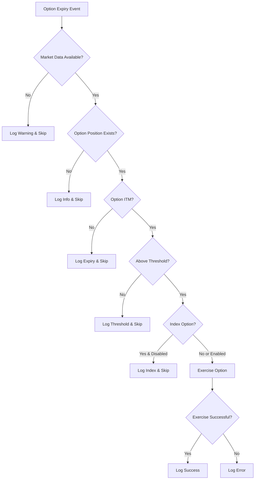

## Example Usage

### Complete Backtest with Option Exercise

```python
import pandas as pd
from nautilus_trader.backtest.engine import BacktestEngine
from nautilus_trader.backtest.option_exercise import OptionExerciseConfig, OptionExerciseModule
from nautilus_trader.model.instruments import OptionContract, Equity

# Create engine and module
engine = BacktestEngine(config)
exercise_module = OptionExerciseModule(OptionExerciseConfig())

# Add venue with module
engine.add_venue(
    venue=Venue("NASDAQ"),
    oms_type=OmsType.NETTING,
    account_type=AccountType.MARGIN,
    starting_balances=[Money(100_000, USD)],
    modules=[exercise_module],
)

# Create instruments
underlying = Equity(...)  # AAPL stock
option = OptionContract(  # AAPL call option
    strike_price=Price(150.0, 2),
    expiration_ns=dt_to_unix_nanos(pd.Timestamp("2024-03-15 16:00:00", tz="UTC")),
    option_kind=OptionKind.CALL,
    multiplier=Quantity.from_int(100),
    # ... other parameters
)

# Add instruments and strategy
engine.add_instrument(underlying)
engine.add_instrument(option)
engine.add_strategy(your_strategy)

# Add market data and run
engine.add_data(market_data)
engine.run()

# Check results
positions = engine.trader.portfolio.positions()
# Should include underlying position if option was exercised
```

### Strategy Example

```python
class OptionStrategy(Strategy):
    def on_start(self):
        self.subscribe_quote_ticks(InstrumentId.from_str("AAPL.NASDAQ"))
        self.subscribe_quote_ticks(InstrumentId.from_str("AAPL240315C00150000.NASDAQ"))

    def on_quote_tick(self, tick):
        if tick.instrument_id.value.endswith("C00150000"):
            # Buy call option
            self.buy(
                instrument_id=tick.instrument_id,
                quantity=Quantity.from_int(1),
                price=tick.ask_price,
            )
```

## Event Flow

### Exercise Process

1. **Timer-Based Processing**: Module processes only when expiry timers fire
2. **Expiry Detection**: Identifies options expiring at current time
3. **Position Lookup**: Finds open positions for expiring options
4. **Price Retrieval**: Gets current underlying market price from exchange cache
5. **Exercise Evaluation**: Checks ITM status and threshold
6. **Event Generation**: Creates OrderFilled events for:
   - Option position closure (at average opening price for unrealized PnL reset)
   - Underlying position creation (at strike price for physical settlement, intrinsic value for cash settlement)
7. **Portfolio Update**: Events processed by execution engine

### Event Timing

- Exercise occurs exactly at option expiration time
- Events are properly sequenced (option close → underlying open)
- Timestamps match expiration time

## Troubleshooting

### Common Issues

**No Exercise Occurring**:

- Check `auto_exercise_enabled=True`
- Verify option is ITM by threshold amount
- Ensure underlying price data available
- Check if index option with `index_exercise_enabled=False`

**Incorrect Position Size**:

- Verify option `multiplier` is correct (typically 100 for equity options)
- Check option position quantity

**Missing Underlying Position**:

- Ensure underlying instrument is added to engine
- Check that underlying symbol matches option's `underlying` field

### Debugging

Enable debug logging to see detailed exercise information:

```python
import logging
logging.getLogger('nautilus_trader.backtest.option_exercise').setLevel(logging.DEBUG)

config = OptionExerciseConfig(
    auto_exercise_enabled=True,
)
```

## Performance Considerations

The timer-based architecture provides optimal performance:

- **Event-Driven Processing**: Only processes when option positions are created or expire
- **No Price Caching**: Market prices retrieved directly from exchange cache only at expiry time
- **Efficient Timer Management**: Uses clock timers instead of continuous polling
- **Cython Implementation**: Compiled C extensions for maximum speed
- **Minimal Memory Usage**: No unnecessary data structures or caching

### Performance Metrics

| Scenario | Processing Overhead | Memory Usage |
|----------|-------------------|--------------|
| No Option Positions | Zero | Minimal |
| 100 Option Positions | Event-driven only | ~1KB per expiry date |
| 1000+ Option Positions | Scales linearly | Efficient timer tracking |

### Performance Improvements

The current implementation includes several optimizations:

- **Eliminated pre_process overhead**: No longer caches prices on every tick
- **Direct cache access**: Retrieves prices from exchange cache only when needed
- **Simplified method hierarchy**: Reduced function call overhead
- **Streamlined configuration**: Minimal config options for better performance

## Troubleshooting

### Diagnostic Flow Chart

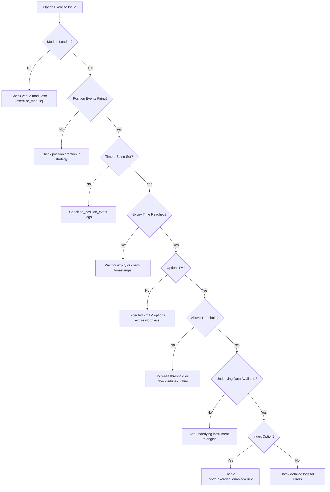

### Common Issues and Solutions

#### Issue: No Exercise Events

**Diagnostic Steps**:

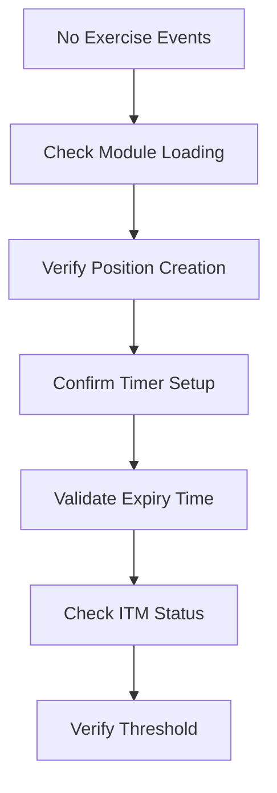

**Solutions**:

1. **Module Not Loaded**: Ensure module is added to venue
2. **No Position Events**: Check if strategy creates option positions
3. **Timer Issues**: Enable logging to see timer setup
4. **Wrong Expiry**: Verify option expiration timestamps
5. **Not ITM**: Check underlying vs strike prices
6. **Below Threshold**: Reduce `exercise_threshold`

#### Issue: Incorrect Position Quantities

**Diagnostic Flow**:

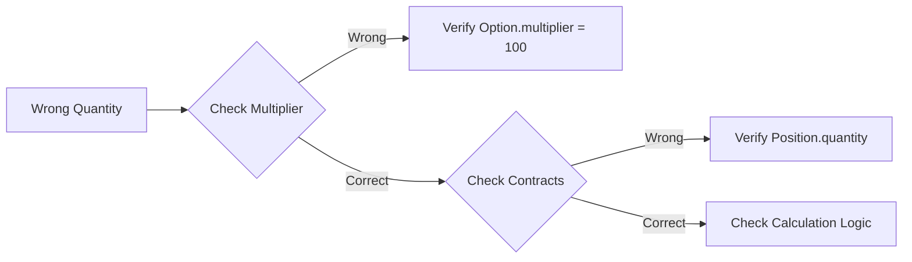

#### Issue: Missing Underlying Positions

**Resolution Steps**:

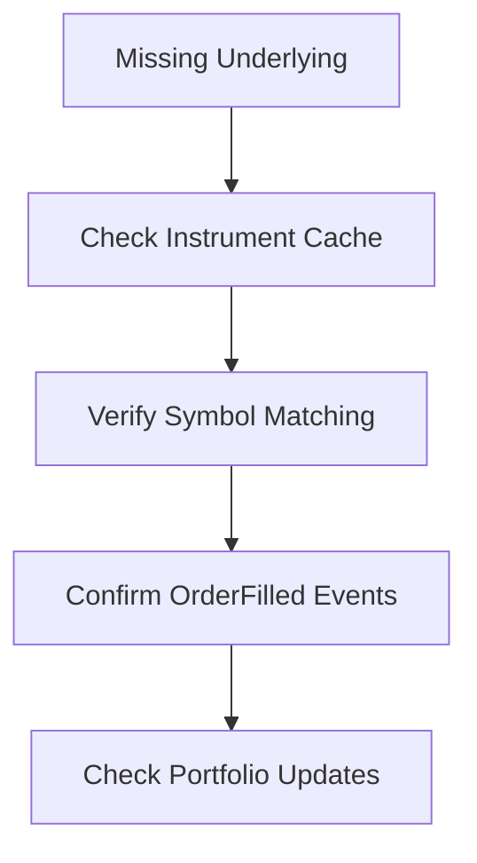

### Debugging Tools

#### Enable Comprehensive Logging

```python
config = OptionExerciseConfig(
    log_exercises=True,        # Log successful exercises
    log_skipped=True,         # Log skipped exercises with reasons
    detailed_logging=True,    # Include detailed calculations
)
```

#### Monitor Module State

```python
# After backtest completion
print(f"Timers set: {len(exercise_module._expiry_timers)}")
print(f"Expiries processed: {len(exercise_module._processed_expiries)}")
print(f"Market prices cached: {len(exercise_module._market_prices)}")
```

#### Diagnostic Output Example

```
2024-03-15T00:00:00.000000000Z [INFO] OptionExerciseModule: Set expiry timer for AAPL240315C00150000.NASDAQ at 1710460800000000000
2024-03-15T00:00:00.000000000Z [INFO] OptionExerciseModule: Processing option expiry: AAPL240315C00150000.NASDAQ
2024-03-15T00:00:00.000000000Z [INFO] OptionExerciseModule: Option ITM: underlying=160.00, strike=150.00, intrinsic=10.00
2024-03-15T00:00:00.000000000Z [INFO] OptionExerciseModule: Exercised 1 AAPL240315C00150000.NASDAQ contracts → 100 AAPL.NASDAQ shares
```

### Performance Monitoring

#### Timer Efficiency Metrics

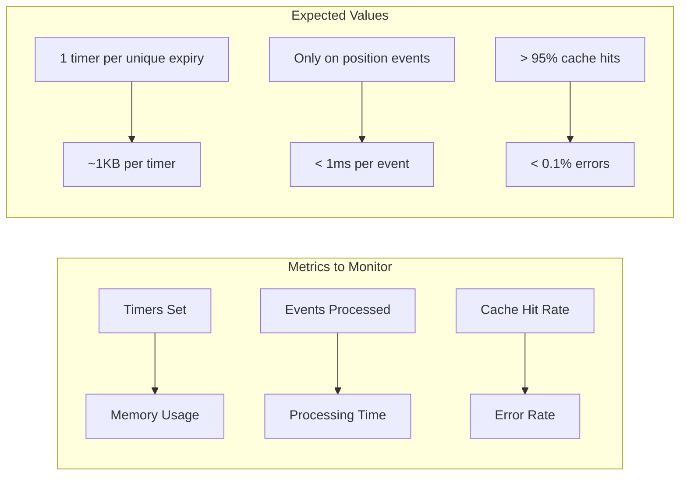

#### Monitoring Code Example

```python
import time
from nautilus_trader.backtest.option_exercise import OptionExerciseModule

class MonitoredOptionExerciseModule(OptionExerciseModule):
    def __init__(self, config):
        super().__init__(config)
        self._metrics = {
            'timers_set': 0,
            'expiries_processed': 0,
            'processing_time': 0,
            'errors': 0,
        }

    def on_position_event(self, event):
        start_time = time.time()
        try:
            super().on_position_event(event)
            if hasattr(self, '_expiry_timers'):
                self._metrics['timers_set'] = len(self._expiry_timers)
        except Exception as e:
            self._metrics['errors'] += 1
            raise
        finally:
            self._metrics['processing_time'] += time.time() - start_time

    def get_metrics(self):
        return self._metrics.copy()
```

```

## Limitations

- Currently supports European-style exercise (at expiry only)
- Requires underlying instrument to be in cache
- Index option exercise is optional (typically cash-settled)
- No early exercise for American options (future enhancement)

## Future Enhancements

- American option early exercise
- Cash settlement for index options
- Exercise fees and commissions
- Margin requirement calculations
